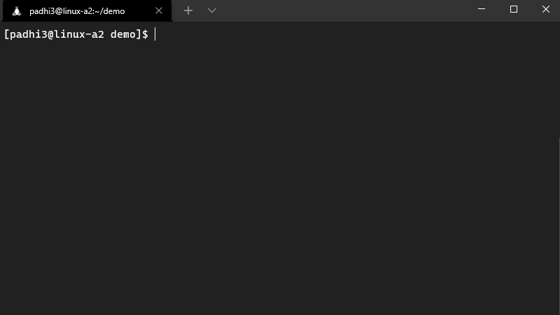

# padhi3-miw3-jorteg38-wpark26

### Overview
Our project allows for the ability for the user to interact and explore the OpenFlights dataset using data structures and algorithms. For our project, we have implemented a shortest path algorithm by using Dijkstra's algorithm and the Betwenness Centrality Algorithm.

### Installation and Building

1. Clone the git repository.
2. While in the root of the git repo, run `./fetch_data.sh` in order to fetch the required data sets
3. Navigate into `flights` using `cd flights` so that you're in the flights directory.
3. Enter the command `make all` to build both the main executable and the tests

#### Running the main program
1. While in the `flights` directory run `./flights`.
2. Follow the instructions on screen to interact with the dataset.
    - *The main program contains a command line interface that loads the entire data set and allows for the user to run and interact with our algorithms.*

#### Executing the test suite
1. While in the `flights` directory run `./tests` to run the tests.

#### Example Usage

### Linkage and Locations

Our working directory is in a folder simply called `padhi3-miw3-jorteg38-wpark26`, and there are 9 files and one folder containted therein:
1. The folder labeled `flights` contains the bulk of our relevant code, you will need to run `cd flights` to get into it
2. The file `.-clang-format` is there to make sure everything is formatted according to the google style guide using clang
3. The file `.gitignore` exists for the purpose of making sure we can extract data from linked files properly, which I`ll get into later
4. The file `CONTRACT.md` is a straighforward description of the norms our team has been following for the project for personal reference
5. The file `DEVLOG.md` is a weekly summary of what was accompished in a given week, maintained to provide context to our progress
6. The file `PROPOSAL.md` is a description of what specific goals we chose and why, along with our inital plans on accomplishing them
7. The file `README.md` is this file you are currently reading, given to provide context to an outside observer or our future selves
8. The file `RESULTS.md` is a summary of what we've accomplished, in other words what we've produced compared to our goals
9. The file `fetch_data.sh` is responsible for acquiring our source files from their original links, ensuring use of the original dataset

Within the `flights` folder there are 3 folders and 12 files which make up the bulk of our code:
1. The folder labeled `cs225` holds files from the given cs225 directory, which are the catch and make setups for testing and compiling
2. The folder labeled `tests` contains tests for the general setup (see `test.cpp`) and graph code (see `test_graph.cpp`)
3. `Makefile` is simply there in order to alllow for easy compilation of flights (make flights) and tests (make test)
4. `csv_reader.h` and `csv_reader.cpp` comprise the CSV reader class, which reads our retrieved CSV files
5. `main.cpp` is the file used for running the actual code, and to take inputs from the user and give outputs
6. There are also `flights` and `test` executables, which can be run using `./flights` and `./test` if compiling has occurred
7. The remaining files make up our classes for routes, airports, and graphs, with the bulk of our code inside of them

### Testing notes
#### Test Suite Tags
`[Djik]` - Runs tests related to the accuracy of Djikstra's algorithm and its edge cases

`[Central]` - Runs tests related to the accuracy of between centrality mapping and its edge cases

`[Graph]` - Runs tests related to the functions of the graph class. Contained in test_graph.cpp

#### Adding additional tests
Helper functions are implemented in test files if the user wishes to add additional test cases. For visualizing the output of Djikstra's algorithm there is a custom vecToString function which prints the IATA of the airports in the output. There are also helper methods that construct a simple graph for testing the functions of the graph class. 
