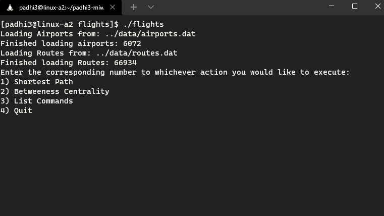

# First a rundown of what our two algorithm's actually produce:

Our shortestPath function intakes the name of a starting airport in IATA code and the name of a destination airport in IATA code and returns a vector of the IATA's
of the airports on the shortest path. This is what we intended and originally described, so we have fufilled our goal for this method.

Our calculateBetweennessCentrality function intakes the names of two airports in IATA code and returns a map of the betweeness heuristics of all airports relative
to those two airports. Our getCentralAirport function intakes the IATAs of a starting and ending airport, then uses calculateBetweennessCentrality to find the most
central airport between those airports. This is, unfortunately, not what we originally intended, as the idea was to be able to input any number of vertices, but
our function can only take one. Unfortately, we were not able to figure out how to successfully implement for multiple vetices before the deadline. Additionally, 
we ran into an issue where, when two locations are particularly far from each other, the accuracy of results decreases, in exchange for the use of our pruning
algorithm, which runs inside of calculateBetweennessCentrality to optimize the runtime. Realistically if runtime wasn't a big problem, we could find more accurate
answers when inputs were further from each other, but we chose efficiency for most cases we care about instead of less efficiency for everything to accomadate
extra use cases, for better or for worse.

# Now a quick demonstration of each algorithm being run on the dataset:
This is the centrality algorithm showing the most central airport between Boston and JFK airport.

These are the shortest path algorithm being demonstrated between two airports showing the shortest path between them. 

# Below are our results as they pertain to our initial goals:

(That is, below are the shortest paths from Chicago's O'Hare (ORD) airport to our given destinations of choice
along with the most central airport to our selection of favorite airports.)
